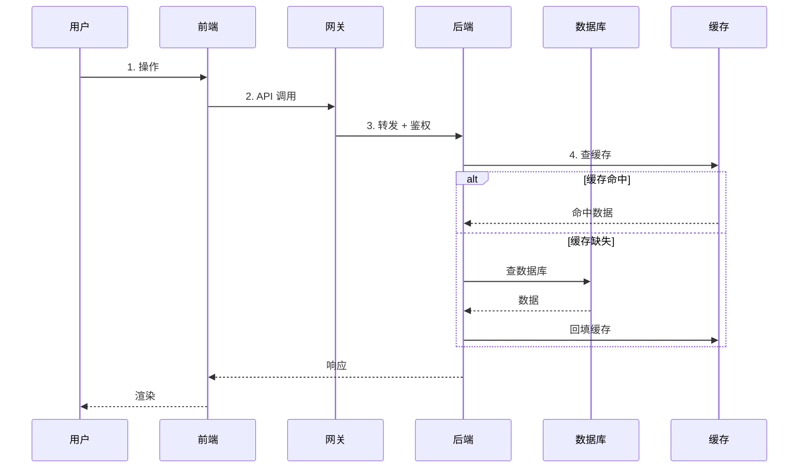
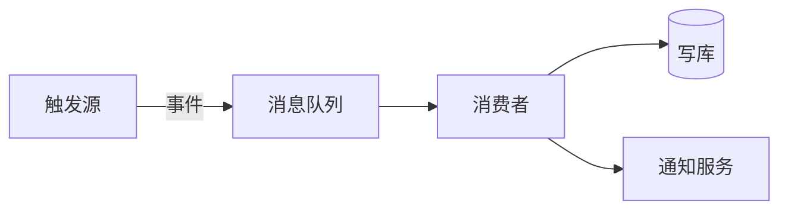

# {{PROJECT}} 数据流

> 描述系统内部数据如何在角色 / 模块 / 存储间流动。
> 重要场景每个画一张 mermaid 时序图，避免长篇文字。

## 1. 核心业务时序

## 2. 关键场景

### 场景 A：用户登录

- 输入：账号 / 密码
- 处理：用户表查询 → 密码比对 → 签发 JWT
- 输出：token，写入 Redis 黑名单 / 白名单
- 涉及表：users / sessions
- 涉及模块：auth

### 场景 B：_TBD_

_（按相同结构补全）_

## 3. 异步 / 事件流

| 事件 | 生产者 | 消费者 | 频率 | 失败策略 |
| --- | --- | --- | --- | --- |
| _TBD_ | _TBD_ | _TBD_ | _TBD_ | _TBD_ |

## 4. 数据流矩阵

| 来源 | 去向 | 触发 | 频率 | 体积 |
| --- | --- | --- | --- | --- |
| _TBD_ | _TBD_ | _TBD_ | _TBD_ | _TBD_ |

## 5. 关联

- 数据模型详见 [`../database/er-diagram.md`](../database/er-diagram.md)
- 各模块流程见 [`../modules/`](../modules/)
