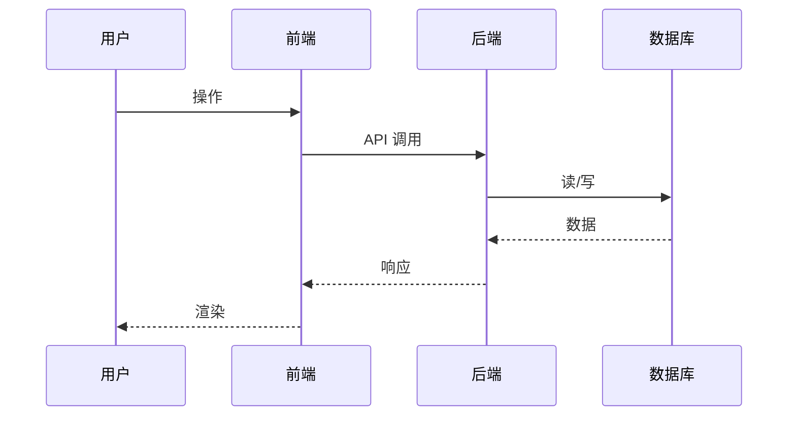

# {{PROJECT}} 数据流

## 1. 核心业务流

## 2. 关键数据流场景

### 场景 A：_TBD_

_（描述输入 / 处理 / 输出 / 涉及的模块和表）_

### 场景 B：_TBD_

## 3. 异步任务流

_（如果有消息队列 / 定时任务 / 事件总线，在这里描述）_

## 4. 数据流向矩阵

| 来源 | 去向 | 触发 | 频率 |
| --- | --- | --- | --- |
| _TBD_ | _TBD_ | _TBD_ | _TBD_ |
