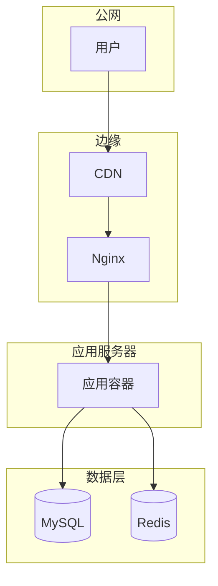

# {{PROJECT}} 部署架构

## 1. 部署拓扑

## 2. 环境分层

| 环境 | 域名/IP | 用途 | 部署方式 |
| --- | --- | --- | --- |
| prototype | _TBD_ | 原型演示 | _TBD_ |
| test | _TBD_ | 内部测试 | _TBD_ |
| demo | _TBD_ | 客户演示 | _TBD_ |
| prod | _TBD_ | 生产 | _TBD_ |

## 3. 资源清单

| 资源 | 规格 | 数量 | 备注 |
| --- | --- | --- | --- |
| 应用服务器 | _TBD_ | _TBD_ | _TBD_ |

## 4. CI/CD 流程

_（描述代码 → 构建 → 部署的完整链路，引用 deploy-app skill）_

## 5. 关联 ADR

- ADR-NNN: 部署方案决策
