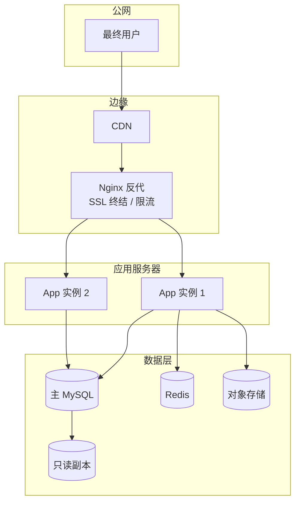
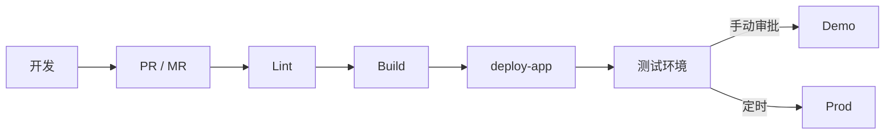

# {{PROJECT}} 部署架构

> 与 `deploy-app` skill 配合使用。本文件描述「目标拓扑」，实际部署步骤在 deploy-app 配置仓里。

## 1. 部署拓扑

## 2. 环境矩阵

| 环境 | 域名 / IP | 用途 | 部署方式 | 自动化 |
| --- | --- | --- | --- | --- |
| prototype | _TBD_ | 原型演示，仅静态 | scp + nginx | 手动 |
| test | _TBD_ | 内部联调 | docker-compose | CI 触发 |
| demo | _TBD_ | 客户演示 | docker-compose | 手动 |
| prod | _TBD_ | 生产环境 | docker-compose / k8s | CI 灰度 |

## 3. 资源清单

| 资源 | 规格 | 数量 | 单价 | 备注 |
| --- | --- | --- | --- | --- |
| 应用服务器 | _TBD_ | _TBD_ | _TBD_ | _TBD_ |
| 数据库 | _TBD_ | _TBD_ | _TBD_ | _TBD_ |
| 对象存储 | _TBD_ | - | 按量 | _TBD_ |
| CDN | - | - | 按量 | _TBD_ |

## 4. CI/CD 流程

详见：`deploy-app` skill 仓库内的 `apps.json` / `environments.json`。

## 5. 回滚 / 灾备

- **回滚机制**：_TBD_（蓝绿 / 滚动 / 镜像 tag）
- **数据备份**：_TBD_（频率 / 保留期 / 验证）
- **灾备演练**：_TBD_

## 6. 关联 ADR

- ADR-NNN：部署平台选型
- ADR-NNN：数据备份策略
