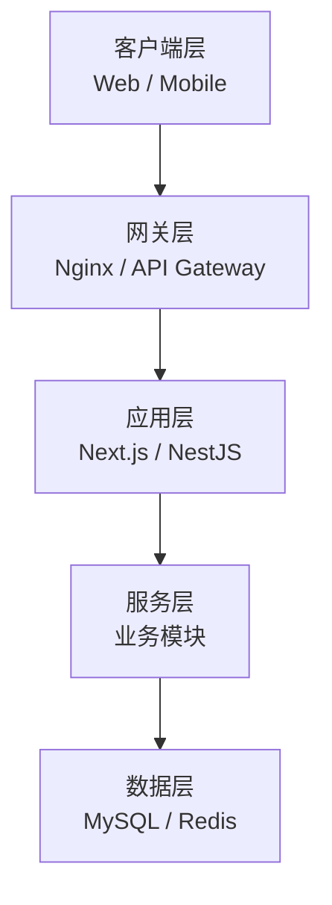
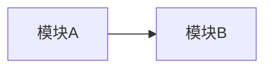

# {{PROJECT}} 总架构

> 维护者：_TBD_ ｜ 最后更新：_TBD_

## 1. 业务背景

_（一段话说清这个项目要解决什么问题、目标用户、核心价值）_

## 2. 架构分层

## 3. 关键技术栈

| 维度 | 选型 | 决策记录 |
| --- | --- | --- |
| 前端 | _TBD_ | ADR-001 |
| 后端 | _TBD_ | ADR-001 |
| 数据库 | _TBD_ | ADR-002 |
| 部署 | _TBD_ | ADR-003 |

## 4. 模块清单

| 模块 | 角色 | 关联 REQ 数 | 优先级 | 状态 |
| --- | --- | --- | --- | --- |
| _example_ | _示例_ | 0 | P2 | 草稿 |

## 5. 跨模块依赖

## 6. 参考

- 部署架构：`./deployment.md`
- 数据流：`./data-flow.md`
- 数据模型：`../database/er-diagram.md`
- API 设计：`../api/api-design.md`
