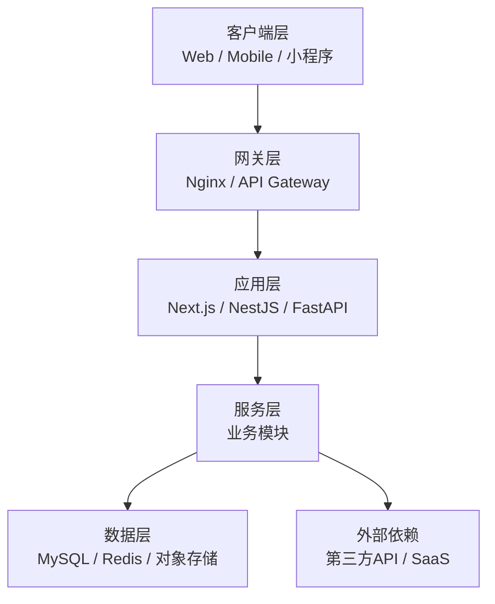
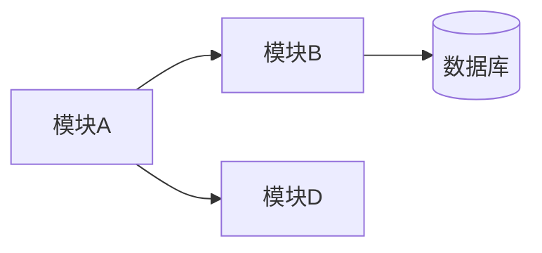

# {{PROJECT}} 总架构

> 维护者：_TBD_ ｜ 最后更新：{{INIT_AT}}
> 上下文：本文件是项目方案的"门面"，新人接手必读。约 100~200 行为宜，深度细节拆到对应子文档。

## 1. 业务背景

> 写作要点：用户是谁、痛点是什么、为什么要做这个、成功标准如何衡量。
> 一段话讲清，避免堆砌。

_TBD_

## 2. 架构分层

## 3. 关键技术栈

| 维度 | 选型 | 决策记录 | 备注 |
| --- | --- | --- | --- |
| 前端框架 | _TBD_ | ADR-001 | _TBD_ |
| 后端框架 | _TBD_ | ADR-001 | _TBD_ |
| 数据库 | _TBD_ | ADR-002 | _TBD_ |
| 缓存 / 队列 | _TBD_ | ADR-NNN | _TBD_ |
| 部署平台 | _TBD_ | ADR-003 | _TBD_ |
| 鉴权方案 | _TBD_ | ADR-NNN | _TBD_ |

## 4. 模块清单

> 提示：本表通过 `sync-solution-map.sh` 可自动从 modules/ 拉取生成草稿。

| 模块 | 中文名 | 类型 | 关联 REQ 数 | 优先级 | 状态 |
| --- | --- | --- | --- | --- | --- |
| _example_ | _示例_ | business | 0 | P2 | 草稿 |

## 5. 跨模块依赖

> 维护要点：每条依赖箭头要在对应模块的 design.md "跨模块依赖" 一节里有呼应。

## 6. 非功能性需求

| 维度 | 目标 | 验证方式 |
| --- | --- | --- |
| 性能 | API P95 < 200ms | 压测脚本 |
| 可用性 | 99.5% | 监控告警 |
| 数据安全 | _TBD_ | _TBD_ |
| 可扩展性 | _TBD_ | _TBD_ |

## 7. 关联文档

- 部署架构：[`./deployment.md`](./deployment.md)
- 核心数据流：[`./data-flow.md`](./data-flow.md)
- 数据模型：[`../database/er-diagram.md`](../database/er-diagram.md)
- API 总览：[`../api/api-design.md`](../api/api-design.md)
- 决策记录：[`../adr/README.md`](../adr/README.md)
