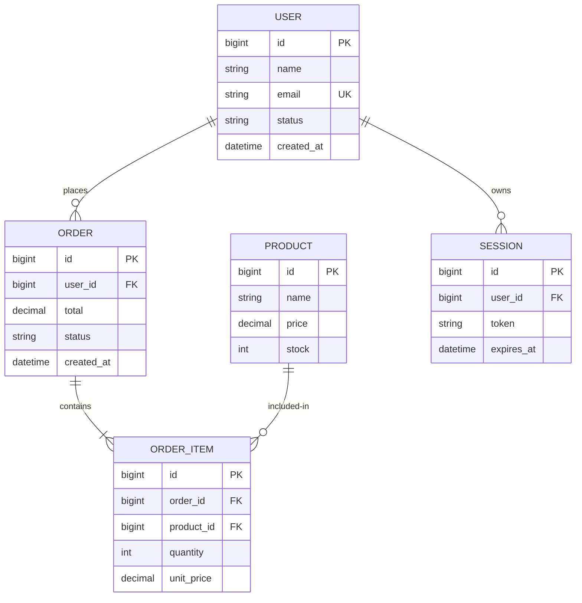

# {{PROJECT}} ER 图

> 用 mermaid `erDiagram` 维护实体关系。字段细节见 [`./schema.md`](./schema.md)。

## 全景 ER 图

## 实体说明

| 实体 | 业务含义 | 主键策略 | 软删除 |
| --- | --- | --- | --- |
| USER | 用户 | 自增 bigint | ✔ |
| ORDER | 订单 | 自增 bigint | ✘（状态机标记） |
| PRODUCT | 商品 | 自增 bigint | ✔ |

## 关键关系

- **USER 1:N ORDER**：一个用户多个订单
- **ORDER 1:N ORDER_ITEM**：一个订单多个明细
- **PRODUCT 1:N ORDER_ITEM**：一个商品出现在多个订单

## 分层 ER（可选）

> 当实体超过 ~20 个时，按域拆分子 ER 图。

### 子域 A：用户 & 鉴权

### 子域 B：_TBD_
