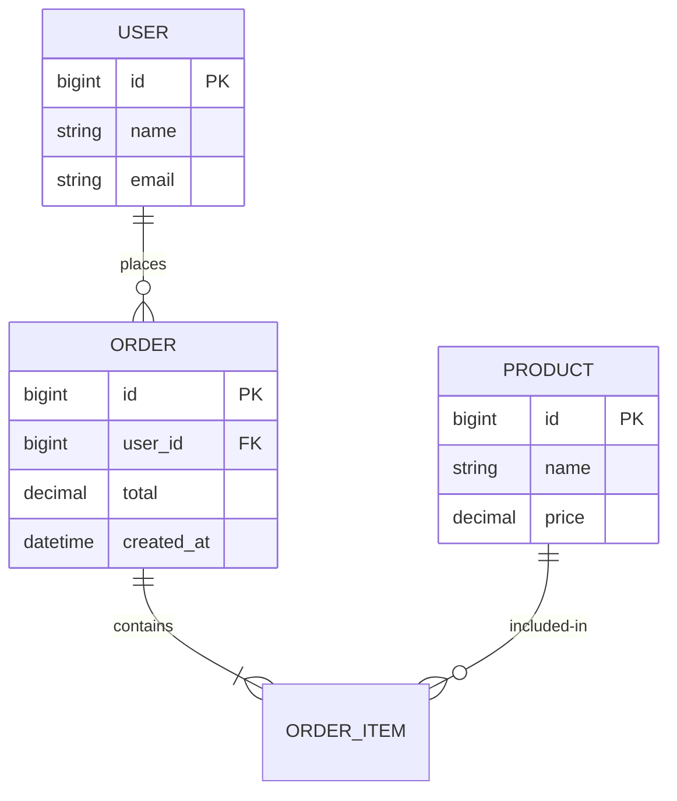

# {{PROJECT}} ER 图

> 用 mermaid `erDiagram` 维护实体关系。表结构细节见 `./schema.md`。

## 实体说明

| 实体 | 业务含义 | 主键策略 |
| --- | --- | --- |
| USER | 用户 | 自增 bigint |
| ORDER | 订单 | 自增 bigint |

## 关键关系

- USER 1:N ORDER（一个用户多个订单）
- ORDER 1:N ORDER_ITEM（一个订单多个明细）
