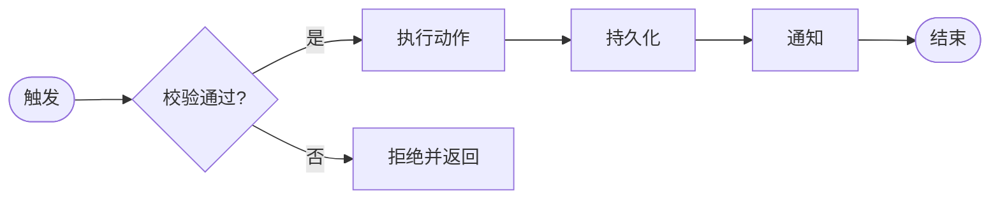
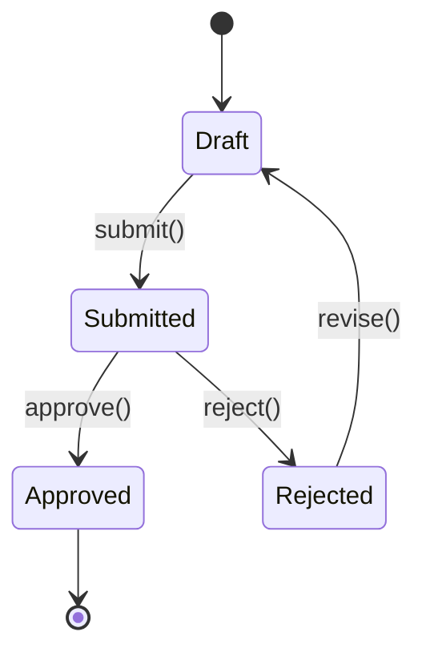

# 模块：{{MODULE_NAME}}

> Slug: `{{MODULE_SLUG}}` ｜ 状态：草稿 ｜ 维护者：_TBD_
>
> 新建模块时拷贝本目录：
> ```bash
> cp -r modules/_example modules/<your-module>
> ```

## 1. 模块定位

> 一段话说清：
> - **做什么**：核心职责
> - **不做什么**：边界声明（防止职责蔓延）
> - **服务对象**：哪些角色 / 模块依赖它

_TBD_

## 2. 关联 REQ

| REQ-ID | 标题 | 优先级 | 状态 |
| --- | --- | --- | --- |
| _见 ./reqs.json_ | | | |

> JSON 是单一信任源；本表是阅读视图，可由 `sync-solution-map.sh` 协助生成。

## 3. 关键流程



## 4. 涉及表

| 表名 | 角色 | 主要操作 | 备注 |
| --- | --- | --- | --- |
| _TBD_ | 主表 | CRUD | _TBD_ |
| _TBD_ | 关联表 | R | _TBD_ |

## 5. API 清单

详见 [`./apis.json`](./apis.json)。

| Method | Path | 说明 | 鉴权 |
| --- | --- | --- | --- |
| _TBD_ | _TBD_ | _TBD_ | _TBD_ |

## 6. 跨模块依赖

| 依赖模块 | 用途 | 协议 | 容错策略 |
| --- | --- | --- | --- |
| _TBD_ | _TBD_ | 函数调用 / HTTP / 事件 | 降级 / 重试 / 熔断 |

## 7. 状态机（如有）



## 8. 关联 ADR

- ADR-NNN：_TBD_

## 9. 风险 / 待办

- [ ] _风险 1_
- [ ] _待补充的设计点_

## 10. 测试要点

- **核心路径**：_TBD_
- **边界条件**：_TBD_
- **异常处理**：_TBD_
- **性能基线**：_TBD_
